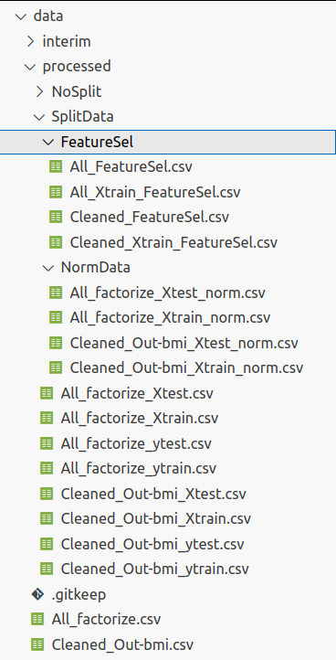
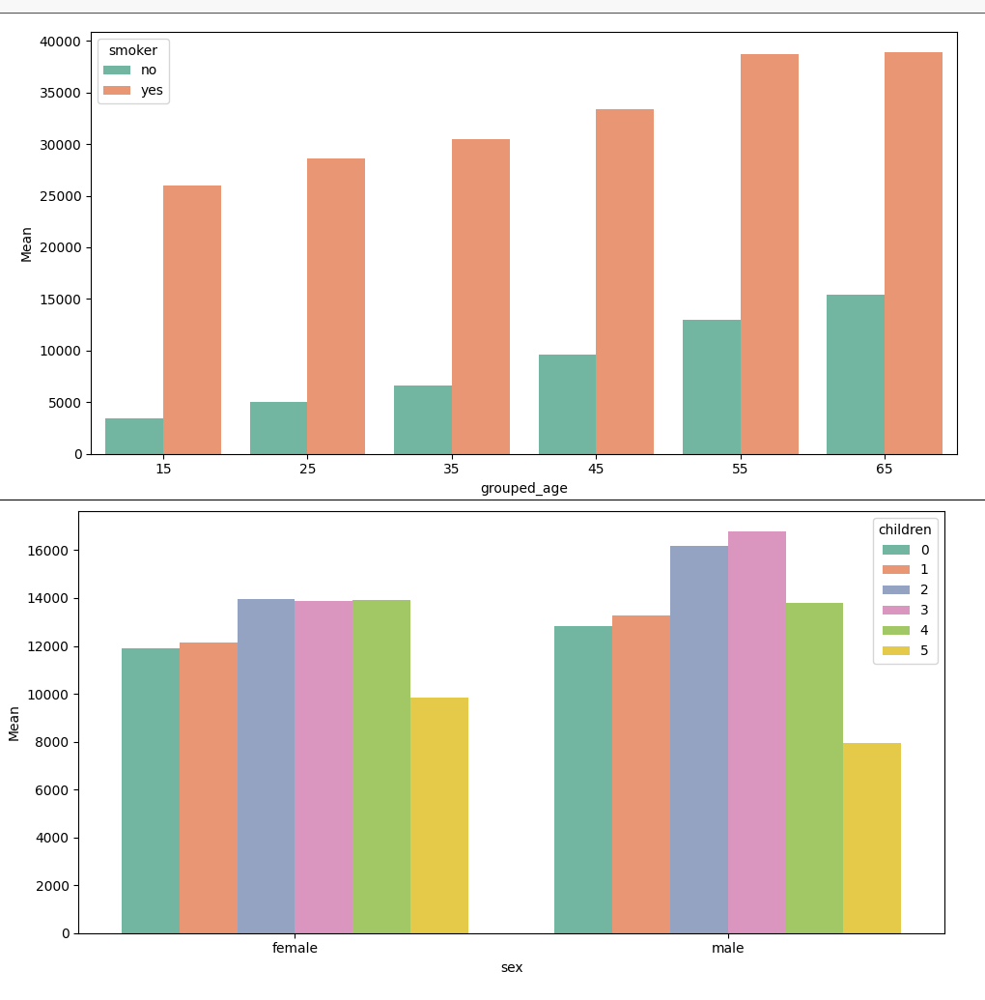
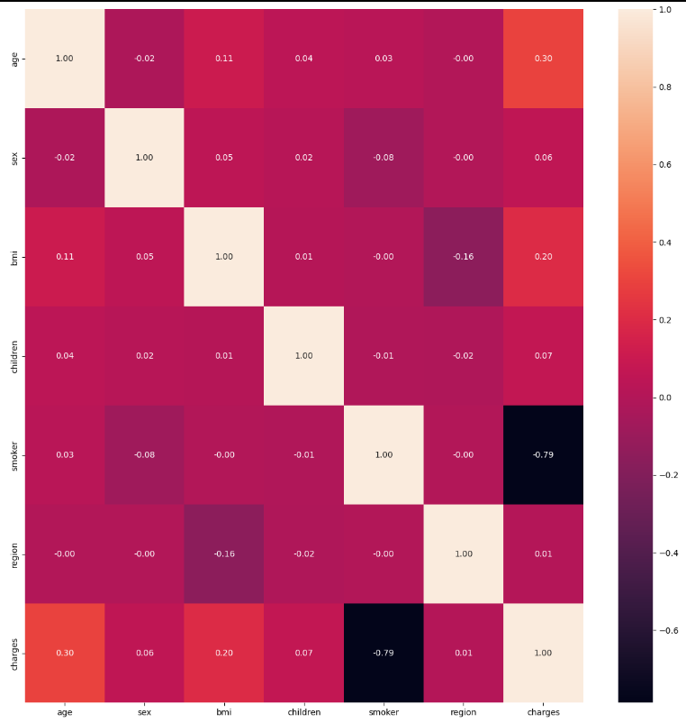
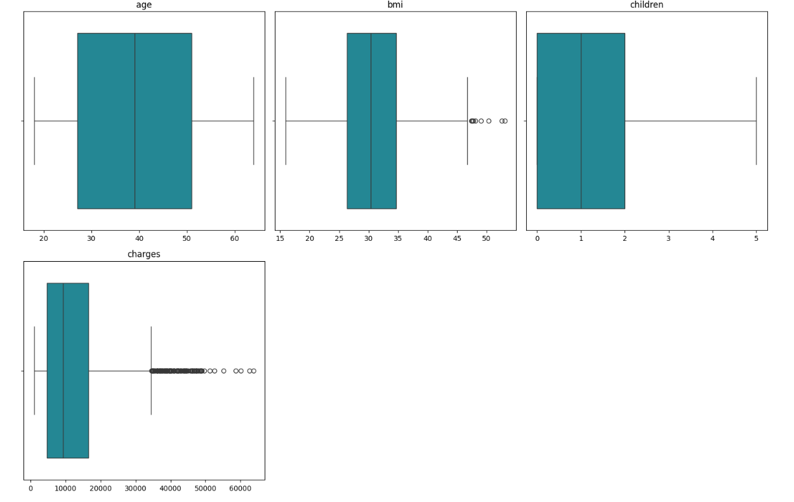

# EDAS V0.17

<!-- Here edas_tatmil should be replaced with your library's name on PyPI  -->
[](https://badge.fury.io/py/edastatmil-milser)
[](https://pypi.org/project/edastatmil-milser/)

This library is [`edastatmil-milser`](https://github.com/milser/Python-library-template/search?q=edas_tatianamilser&unscoped_q=edas_tatianamilser) 

## General Description  
This library provides useful tools for performing a complete EDA.

> **⚠️ Note:** This module is in development and may contain errors.

> **⚠️ Note:** Some functions only apply to very general cases. To perform a good EDA, it is necessary to understand the specific case being worked on, and in many cases, actions that are not covered in this module will be needed.

> **⚠️ Note:** Please read the function descriptions carefully, as some require a specific file system. The final file structure if the EDA is done with edastatmil-milser is shown in the following figure:



## Installation
1. **Requirements:**  
   - tabulate  
   - pandas  
   - matplotlib.pyplot  
   - seaborn  
   - math  
   - os  
   - sklearn.model_selection  
   - importlib  
   These can be installed from the terminal with `pip install`.

2. **Install the library:**  
   ```bash
   pip install edastatmil-milser

3. **Import the library:**  
   ```bash
   from edastatmil_milser import edas_tatmil as EDA

4. **Example function call**
   ```bash
   EDA.function_example

## Functions
### `get_column_type(series)`

This function studies whether a feature is numerical or categorical.

- **Attributes:** not required.

- **Usage example:**
  ```python
  variables = pd.DataFrame({'Data Type': data_frame.dtypes})
  variables['Data category'] = df.apply(EDA.get_column_type)

Adds a new column to the 'variables' dataframe called 'Data type' indicating whether the variable is categorical or numerical.
- **Return:**
   'Categorical' if the variable is categorical, 'Numerical' if it is numerical.

### `explore(data_frame)`

This function gives a general idea of the dataframe's content.

- **Attributes:** 
   - data_frame: the name of the dataframe to be explored.

- **Usage example:**
  ```python
  categorical_list, numerical_list = EDA.explore(df_example)

Displays the number of columns and rows and a table with information about non-null, null values, data type, and category of the variables.

- **Return:**
   List of categorical variables and list of numerical variables.

### `FindDuplicates(data_frame, id_col, Drop=False)`

This function looks for duplicates in a column and gives the option to remove the duplicate rows or not.

- **Attributes:** 
   - data_frame: the name of the dataframe to be explored.
   - id_col: name of the column in which duplicates are to be searched.
   - Drop: if True, it will remove the duplicate lines; if False, it will leave them. Default is False.

- **Usage example:**
  ```python
  df_without_duplicates = EDA.FindDuplicates(df_example, 'id_host', Drop=True)
Returns the dataframe without duplicate rows according to the 'id_host' column.

- **Return:**
   If Drop=True, dataframe without duplicates. If Drop=False, dataframe with duplicates. In both cases, it prints the number of duplicates found.

### `Find_over_50_percent_value(df)`

This function searches for elements that occupy more than 50\% of their column and shows information about them.

- **Attributes:** 
   - data_frame: the name of the dataframe to be explored.

- **Usage example:**
  ```python
  EDA.Find_over_50_percent_value(df_example)
Shows information about irrelevant values in the dataframe.

- **Return:**
   None.

### `univariate_hist(variables, data_frame, color='#1295a6', kde=False)`

This function creates a histogram for each variable in the 'variables' list. It will display them in a figure with three histograms per row.

- **Attributes:** 
   - data_frame: the name of the dataframe to be explored.
   - variables: the list of variables for which histograms are to be created.
   - color: color. Default is turquoise.
   - kde: if True, the kernel density estimation line is shown on the graph; if False, it is not shown. Default is False.

- **Usage example:**
  ```python
  list = ['age,'smoke','region','children']
  EDA.univariate_hist(list,df_example)
Draws a figure with 4 histograms, three in the first row and one in the second, without kernel density estimation line and in turquoise.

- **Return:**
   Displays the figure.

### `univariate_histbox(variables, data_frame, color='#1295a6')`

This function creates a histogram and a box plot for each variable in the 'variables' list. It will display them in a figure with three histograms+box plots per row.

- **Attributes:** 
   - data_frame: the name of the dataframe to be explored.
   - variables: the list of variables for which histograms and box plots are to be created.
   - color: color. Default is turquoise.

- **Usage example:**
  ```python
  list = ['age,'smoke','charges','bmi']
  EDA.univariate_histbox(list, df_example)

### `multivariate_barplots(df, variable_lists,y='count',palette='Set2')`

This function creates a multivariable bar plot for each set of variables within the 'variable_lists' list. It will display them in a figure with one plot per row.

- **Attributes:** 
   - df: the name of the dataframe to be explored.
   - variable_lists: a list of lists such that ['variable on x-axis','variable on y-axis','discrimination variable']. The 'y' variable must be numeric.
   - y: what the bar heights represent. If 'count', the bar heights represent the number of elements in the group with the 'y' variable. If 'mean', the heights will represent the mean. Default is 'count'.
   - palette: Color palette. Default is seaborn's default 'Set2'.

- **Usage example:**
  ```python
  variable_lists=[['age','charges','smoker'], ['sex','charges','children']]
  EDA.multivariate_barplots(df, variable_lists,y='mean')


Draws a figure with 2 bar plots. In the first one, age is represented on the x-axis, with one bar for each value of the smoker column, and the bar height represents the mean of the 'charges' variable for each group. In the second plot, age is represented on the x-axis, with one bar for each value of the 'children' column, and the bar height represents the mean of 'charges' for each group.

- **Return:**
   Displays the figure.

### `factorize_categorical(df,cols_to_factor)`

This function factorizes the categorical variables included in the 'cols_to_factor' list and replaces the value in the column with the one assigned in the factorization.

- **Attributes:** 
   - df: the name of the dataframe to be explored.
   - cols_to_factor: a list of categorical variables.

- **Usage example:**
  ```python
  fz_df = factorize_categorical(df,variables_list)

- **Return:**
   Returns the dataframe with the indicated variables factorized.

### `correlation_matrix(df, variables_list)`

This function constructs and displays a correlation matrix heatmap.
> **⚠️ Note:** It is not necessary to factorize categorical variables before calling this function. Just include them in the list.

- **Attributes:** 
   - df: the name of the dataframe to be explored.
   - variables_list: list of the categorical variables from your dataframe that are not factorized. 

- **Usage example:**
  ```python
  df_factorice = EDA.correlation_matrix(raw_df, categorical_list)

- **Return:**
   Displays the figure and returns the dataframe with the factorized categorical variables.

### `numerical_box(variables, data_frame, color='#1295a6')`

This function creates a box plot for each variable in the list and displays them in a figure with three plots per row.

- **Attributes:** 
   - data_frame: the name of the dataframe to be explored.
   - variables: list of the variables for which box plots are to be created. They must be numeric.
   - color: color. Default is turquoise. 

- **Usage example:**
  ```python
  numerical = ['age','bmi','children','charges']
  EDA.numerical_box(numerical, raw_df)

- **Return:**
   Displays the figure.

### `outliers_iqr(df,var,sigma,Do='nothing')`

This function searches for outliers in the indicated column, using the interquartile range criterion (75%-25%). It adjusts the upper and lower limits of the accepted value range with a sigma parameter. There are different options for handling the found outliers.
> **⚠️ Note:** This function is not the only way to handle outliers, and for specific cases not covered here, manual intervention may be necessary.

> **⚠️ Note:** This function will attempt to handle ALL outliers in the same column as indicated.

- **Attributes:** 
   - df: the name of the dataframe to be explored.
   - var: the variable on which outliers are to be searched.
   - sigma: the parameter for adjusting the accepted value range.
   - Do: what to do with the outliers. If `Do.NOTHING`, it counts them but does nothing. If `Do.MODE`, `Do.MEDIAN`, or `Do.MEAN`, it replaces them with the mode, median, or mean respectively. If `Do.DROP`, it removes the rows with the outliers from the dataframe. 

- **Usage example:**
  ```python
  outliers, cleaned_df = EDA.outliers_iqr(raw_df,'bmi',1,Do=Do.NOTHING)
In this case, cleaned_df will not have the outlier rows because 'drop' option is chosen.
- **Return:**
  Returns a dataframe with the outliers and another dataframe with the outliers treated according to the chosen method. In any case, it will print the number of outliers found.

### `splitter(origin_root,predictors,target)`

This function splits all dataframes found in the indicated path into train and test sets.
> **⚠️ Note:** Make sure that only the dataframes to be split are in the indicated path. The rest should be saved in another folder.

> **⚠️ Note:** Make sure to name the initial files properly so that you can later differentiate all resulting files from the split.

- **Attributes:** 
   - origin_root: the path where the dataframes to be split are located, including / at the end.
   - predictors: list of predictor variables.
   - target: name of the target variable. 

- **Usage example:**
  ```python
  predictors = ['age', 'sex', 'bmi', 'children', 'smoker', 'region']
  target = 'charges'
  EDA.splitter('../data/processed/',predictors,target)
All dataframes saved in the path '../data/processed/' will be split into train and test sets.
- **Return:**
  Creates a folder in the indicated path named SplitData. Inside, you will find all resulting dataframes from the split of each file. To the original file names, the suffixes _Xtrain, _Xtest, _ytrain, _ytest will be added to differentiate them.

### `normalize(origin_root,predictors,scaler='StandardScaler')`

This function normalizes the data of the predictor variables.
> **⚠️ Note:** Remember that the target variable is not normalized.

> **⚠️ Note:** Before using this function, categorical variables must be factorized.

> **⚠️ Note:** Make sure that the files you want to normalize include the suffix _X.

- **Attributes:** 
   - origin_root: the path where the dataframes to be normalized are located, including / at the end.
   - predictors: list of predictor variables.
   - scaler: name of the scaling function to be used. It can be any from the sklearn.preprocessing library. Default is StandardScaler.

- **Usage example:**
  ```python
  predictors = ['age', 'sex', 'bmi', 'children', 'smoker', 'region']
  EDA.normalize('../data/processed/SplitData/',predictors,scaler='StandardScaler')
Predictor variables of all dataframes located in the directory '../data/processed/SplitData/' and containing the suffixes _Xtrain,_Xtest in their file names will be normalized.
- **Return:**
  Creates a folder in the indicated path named NormData. Inside, you will find all resulting dataframes from the normalization of each dataframe. To the original file names, the suffix _norm will be added.

### `feature_sel(X_train,y_train,k,file_name,method='SelectKBest', test='mutual_info_classif')`

This function performs feature selection on the training datasets, leaving a number k of variables and using the specified method and test.
> **⚠️ Note:** Remember that feature selection is not performed on the test data.

- **Attributes:** 
   - X_train: the dataframe containing the training data of the predictors.
   - y_train: the dataframe containing the training data of the target.
   - k: the number of variables to keep.
   - file_name: the name with which to save the resulting dataframe after feature selection.
   - method: the method to use for feature selection.
   - test: the test based on which feature selection is to be performed.

- **Usage example:**
  ```python
  All_X_train = pd.read_csv('../data/processed/SplitData/NormData/All_factorize_Xtrain_norm.csv')
  All_y_train = pd.read_csv('../data/processed/SplitData/All_factorize_ytrain.csv')    
  EDA.feature_sel(All_X_train,All_y_train,k=4,file_name='All_Xtrain', method='SelectKBest', test='mutual_info_regression')
Normalized dataframes can be loaded from wherever they were saved.
A training dataframe will be created containing only the most relevant columns according to the specified method and test.  
- **Return:**
  Creates a folder in the SplitData folder, named FeatureSel, and saves the dataset with only the selected columns with the indicated name and the suffix _FeatureSel and the list of columns.

Version 1.0 (07/04/2024)

When you want to increment the version number for a new release use [`bumpversion`](https://github.com/peritus/bumpversion) to do it correctly across the whole library.
For example, to increment to a new patch release you would simply run

```
bumpversion patch
```

which given the [`.bumpversion.cfg`](https://github.com/milser/Python-library-template/blob/master/.bumpversion.cfg) makes a new commit that increments the release version by one patch release.
