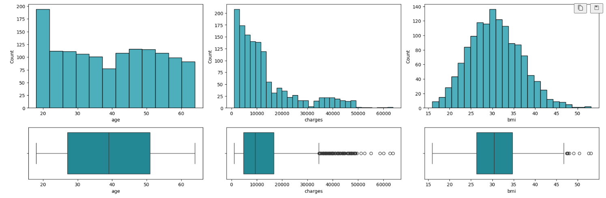

# EDAS V 1.0.0

<!-- Here edas_tatmil should be replaced with your library's name on PyPI  -->
[](https://badge.fury.io/py/edastatmil-milser)
[](https://pypi.org/project/edastatmil-milser/)

This library is [`edastatmil-milser`](https://github.com/milser/Python-library-template/search?q=edas_tatianamilser&unscoped_q=edas_tatianamilser) 

## Descripción General  
Esta librería proporciona herramientas útiles para llevar a cabo un EDA completo.  

> **⚠️ Nota:** Este módulo está en fase de desarrollo y puede tener errores.  

> **⚠️ Nota:** Algunas funciones sólo aplican a casos muy generales. Para hacer un buen EDA se debe comprender el caso específico en el que se trabaja y, en muchas ocasiones, se necesitarán acciones que no están recogidas en este módulo.  

> **⚠️ Nota:** Lea detenidamente la descripción de las funciones, ya que algunas necesitan un sistema específico de archivos. La estructura final de archivos si se hace el EDA con edastatmil-milser se muestra en la siguiente figura:


## Instalación
1. **Requerimientos:**  
   - tabulate  
   - pandas  
   - matplotlib.pyplot  
   - seaborn  
   - math  
   - os  
   - sklearn.model_selection  
   - importlib  
   Pueden instalarse desde la terminal con `pip install`.

2. **Instalar la librería:**  
   ```bash
   pip install edastatmil-milser

3. **Importar lalibrería:**  
   ```bash
   from edastatmil_milser import edas_tatmil as EDA

4. **Ejemplo de llamada de función**
   ```bash
   EDA.function_example

## Funciones
### `build_directory(data_root)`

Esta función crea el sistema de carpetas recomendado para llevar a cabo un EDA completo con esta librería.

- **Atributos:** 
   - data_root: la ruta al archivo principal de datos, con '/' al final.

- **Ejemplo de uso:**
  ```python
   EDA.build_directory('../data/')

- **Return:**
   Si no existen, añade la carpeta 'processed' en la carpeta 'data'. Dentro de 'processed' crea las carpetas 'factorized_mapping', 'NonSplit' y 'SplitData'. Dentro de 'SplitData' crea las carpetas 'FeatureSel' y 'NormData'.

### `get_column_type(series)`

Esta función estudia si una característica es numérica o categórica.

- **Atributos:** no requerido.

- **Ejemplo de uso:**
  ```python
  variables = pd.DataFrame({'Data Type': data_frame.dtypes})
  variables['Data category'] = df.apply(EDA.get_column_type)

Añade una columna nueva al dataframe 'variables' llamada 'Data type' indicando si la variable es categorica o numérica.
- **Return:**
   'Categorical' si la variable es categórica 'Numerical' si es numérica.

### `explore(data_frame)`

Esta función da una idea general del contenido del dataframe.

- **Atributos:** 
   - data_frame: el nombre del dataframe que queramos explorar.

- **Ejemplo de uso:**
  ```python
   categorical_list, numerical_list = EDA.explore(df_ejemplo)

Muestra el numero de columnas y filas y una tabla con información sobre valores no nulos, nulos, tipo de dato y categoría de la variables.

- **Return:**
   Lista de variables categóricas y lista de variables numéricas.

### `FindDuplicates(data_frame, id_col, Drop=False)`

Esta función busca dublicados en una columna y da la opción de eliminar las filas repetidas o no.

- **Atributos:** 
   - data_frame: el nombre del dataframe que queramos explorar.
   - id_col: nombre de la columna en la que se quieren buscar duplicados.
   - Drop: si es True eliminará las líneas repetidas; si es False las dejará. Por defecto es False.

- **Ejemplo de uso:**
  ```python
   df_sinDuplicados = EDA.FindDuplicates(df_ejemplo, 'id_host', Drop=True)
Devuelve el dataframe sin las filas duplicadas según la columna 'id_host'

- **Return:**
   Si Drop=True, dataframe sin duplicados. Si Drop=False, dataframe con duplicados. En ambos casos imprime por pantalla el número de duplicados encontrados.

### `Find_over_50_percent_value(df)`

Esta función busca elementos que ocupen más de un 50\% de su columna y muestra información sobre ellos.

- **Atributos:** 
   - data_frame: el nombre del dataframe que queramos explorar.

- **Ejemplo de uso:**
  ```python
   EDA.Find_over_50_percent_value(df_ejemplo)
Muestra información sobre los valores irrelevantes del dataframe.

- **Return:**
   None.

### `univariate_hist(variables, data_frame, color='#1295a6', kde=False)`

Esta función hace un histograma para cada variable dentro de la lista 'variables'. Los mostrará en una figura con tres histogramas por fila.

- **Atributos:** 
   - data_frame: el nombre del dataframe que queramos explorar.
   - variables: la lista de variables de la que queremos hacer histogramas.
   - color: color. Por defecto es turquesa.
   - kde: si True se muestra la línea de estimación de densidad kernel en la gráfica; si False, no se muestra. Por defecto es False.

- **Ejemplo de uso:**
  ```python
   lista = ['age,'smoke','region','children']
   EDA.univariate\_hist(lista,df_ejemplo)
Dibuja una figura con 4 histogramas, tres en la primera fila y uno en la segunda, sin linea de estimación de densidad y en turquesa.

- **Return:**
   Muestra la figura.

### `univariate_histbox(variables, data_frame, color='#1295a6')`

Esta función hace un histograma y un gráfico de caja para cada variable dentro de la lista 'variables'. Los mostrará en una figura con tres histogramas+caja por fila.

- **Atributos:** 
   - data_frame: el nombre del dataframe que queramos explorar.
   - variables: la lista de variables de la que queremos hacer histogramas y cajas.
   - color: color. Por defecto es turquesa.

- **Ejemplo de uso:**
  ```python
   lista = ['age,'smoke','charges','bmi']
   EDA.univariate\_histbox(lista,df_ejemplo)



- **Return:**
   Muestra la figura.

### `multivariate_barplots(df, variable_lists,y='count',palette='Set2')`

Esta función hace un grafico de barras multivariable para cada conjunto de variables dentro de la lista 'variables'. Los mostrará en una figura con un gráfico por fila.

- **Atributos:** 
   - df: el nombre del dataframe que queramos explorar.
   - variable_lists: es una lista de listas tales que ['variable en eje x','variable en eje y','variable de discriminación']. La variable 'y' debe ser numérica.
   - y: qué se quiere que represente la altura de las barras. Si es 'count' la altura de las barras representa el numero de elementos del grupo con la variable y. Si es 'mean' la altura representará la media. Por defecto es 'count'.
   - palette: Paleta de color. Por defecto es el predefinido de seaborn 'Set2'.

- **Ejemplo de uso:**
  ```python
   variable_lists=[['age','charges','smoker'], ['sex','charges','children]]
   EDA.multivariate_barplots(df, variable_lists,y='mean')


Dibuja una figura con 2 graficos de barras. En el primero se representa en el eje x la edad, hay una barra por cada valor de la columna smoker y la altura de la barra da la media de la variable 'charges' para cada grupo. En el segundo se representa en el eje x la edad, hay una barra por cada valor de la coumna 'children' y la altura de la barra representa la media de 'charges' para cada grupo.

- **Return:**
   Muestra la figura.

### `factorize_categorical(df,cols_to_factor)`

Esta función factoriza las variables categóricas incluidas en la lista cols\_to\_factor y sustituye el valor en la columna por el asignado en la factorización.

- **Atributos:** 
   - df: el nombre del dataframe que queramos explorar.
   - cols_to_factor: es una lista de variables categóricas.

- **Ejemplo de uso:**
  ```python
   fz_df = factorize_categorical(df,variables_list)

- **Return:**
   Devuelve el dataframe con las variables indicadas factorizadas.

### `correlation_matrix(df, variables_list, size)`

Esta función construye y muestra en una mapa de calor la matriz de correlación.
> **⚠️ Nota:** No es necesario factorizar las variables categóricas antes de llamar a esta función. Basta con incluirlas en la lista.

- **Atributos:** 
   - df: el nombre del dataframe que queramos explorar.
   - variables_list: lista de las variables categóricas de tu dataframe que no estén factorizadas. 
   - size: tupla con el ancho y el alto de la figura. Por defecto (20,16).

- **Ejemplo de uso:**
  ```python
   df_factorice, df_factorice_onlynumerical  = EDA.correlation_matrix(raw_df, categorical_list,(10,7))

- **Return:**
   Muestra la figura y devueve dos dataframes. El primer dataframe con las variables categóricas factorizadas como 'variable' y el equivalente categórico como 'variable_0'. El segundo dataframe contiene unicamente las variables numericas y las categóricas factorizadas. 

### `numerical_box(variables, data_frame, color='#1295a6')`

Esta hace un gráfico de caja por cada variable dela lista y los muestra en una figura con tres gráficos por fila.

- **Atributos:** 
   - data_frame: el nombre del dataframe que queramos explorar.
   - variables: lista de las variables de las que se quiera hacer la gráfica de caja. Deben ser numéricas.
   - color: color. Por defecto es turquesa. 

- **Ejemplo de uso:**
  ```python
   numerical = ['age','bmi','children','charges']
   EDA.numerical_box(numerical, raw_df)

- **Return:**
   Muestra la figura.

### `outliers_iqr(df,var,sigma,Do=Do_enum.NOTHING)`

Esta función busca outliers en la columna indicada, con el criterio de rango intercuartílico (75\%-25\%). Se ajustan los límites superior e inferior del intervalo de valores aceptados con un parámetro sigma. Hay diferentes opciones para tratar los outliers encontrados.
> **⚠️ Nota:** Esta función necesita importar Do_enum.

> **⚠️ Nota:** Esta función no es la única forma de tratar los outliers y para casos específicos no contemplados aquí deberá hacerse a mano.

> **⚠️ Nota:** Hay que tener encuenta que esta función tratará de la forma indicada TODOS los outliers de la misma columna.

> **⚠️ Nota:** Esta función es útil para contar y encontrar outliers mediante rango intercuartílico con Do='nothing' y luego, una vez hallados, poder usar otros métodos para su tratamiento.

- **Atributos:** 
   - df: el nombre del dataframe que queramos explorar.
   - var: la variable sobre la que se buscan outliers.
   - sigma: el parámetro de ajuste del intervalo de valores aceptados.
   - Do: qué hacer con los outliers. Si es 'nothing', los cuenta pero no hace nada con ellos. Si es 'mode','median' o 'mean' los sustituye por la moda, mediana o media respectivamente. Si es 'drop' elimina las filas con los outliers del dataframe. Por defecto es 'nothing'.

- **Ejemplo de uso:**
  ```python
   from edastatmil_milser.edas_tatmil import Do_enum
   outliers, cleaned_df =EDA.outliers_iqr(raw_df,'bmi',1,Do=Do_enum.DROP)
En este caso cleaned\_df no tendrá las filas de outliers porque se ha escogido la opción 'drop'.
- **Return:**
  Devuelve un dataframe con los outliers y otro dataframe con los outliers tratados según el procedimiento escogido. En cualquier caso imprimirá por pantalla el numero de outliers encontrados.

### `splitter(origin_root,predictors,target)`

Esta función divide en train y test todos los dataframe encontrados en la ruta indicada.
> **⚠️ Nota:** Hay que asegurarse de que en la ruta indicada sólo están los dataframe que se quieren dividir. El resto deben guardarse en otra carpeta.

> **⚠️ Nota:** Asegúrate de haber nombrado bien los archivos iniciales para luego poder diferenciar todos los archivos resultantes de la división.

- **Atributos:** 
   - origin_root: la ruta donde se encuentran los dataframe que se quieren dividir, incluyendo / al final.
   - predictors: lista de las variables predictoras.
   - target: nombre de la variable objetivo. 

- **Ejemplo de uso:**
  ```python
   predictors = ['age', 'sex', 'bmi', 'children', 'smoker', 'region']
   target = 'charges'
   EDA.splitter('../data/processed/',predictors,target)
Se dividirán en train y test todos los dataframes guardados en la ruta '../data/processed/'
- **Return:**
  Crea una carpeta en la ruta indicada llamada SplitData. Dentro se encuentran todos los dataframes resultantes de la división de cada archivo. A los nombres originales de los archivos se habrá agregado la coletilla _Xtrain, _Xtest, _ytrain, _ytest para diferenciarlos.

### `normalize(origin_root,predictors,scaler='StandardScaler')`

Esta función normaliza los datos de las variables predictoras.
> **⚠️ Nota:** Recuerda que la target no se normaliza.

> **⚠️ Nota:** Antes de usar esta función, las variables categóricas deben estar factorizadas.

> **⚠️ Nota:** Asegúrate de que los archivos que quieres normalizar incluyen la coletilla _X

- **Atributos:** 
   - origin_root: a ruta donde se encuentran los dataframe normalizar, incluyendo / al final.
   - predictors: lista de las variables predictoras.
   - scaler: nombre del la función de escalado que se quiere usar. Puede ser cualquiera de la librería sklearn.preprocessing. Por defecto es StandardScaler.

- **Ejemplo de uso:**
  ```python
   predictors = ['age', 'sex', 'bmi', 'children', 'smoker', 'region']
   EDA.normalize('../data/processed/SplitData/',predictors,scaler='StandardScaler')
Se normalizarán las variables predictoras de todos los dataframe que se encuentren en el directorio '../data/processed/SplitData/' y que contengan las coletillas _Xtrain,_Xtest en su nombre de archivo.
- **Return:**
  Crea una carpeta en la ruta indicada llamada NormData. Dentro se encuentran todos los dataframes resultantes de la normalización de cada dataframe. A los nombres originales de los archivos se habrá agregado la coletilla _norm

### `feature_sel(X_train,y_train,k,file_name,method='SelectKBest', test='mutual_info_classif')`

Esta función hace el feature selection sobre los dataset de entrenamiento, dejando un numero k de variables y usando el método y test indicados.
> **⚠️ Nota:** Recuerda que el feature selection no se hace sobre los datos de testeo.

- **Atributos:** 
   - X_train: el dataframe que contiene los datos de entrenamiento de las predictoras.
   - y_train: el dataframe que contiene los datos de entrenamiento de la target.
   - k: el número de variables que se quiere dejar.
   - file_name: el nombre con el que se quiere guardar el dataframe resultante de hacer la selección de características.
   - method: el método con el que se quiere hacer la selección.
   - test: el test en base al cual se quiere hacer la selección.

- **Ejemplo de uso:**
  ```python
   All_X_train = pd.read_csv('../data/processed/SplitData/NormData/ All_factorize_Xtrain_norm.csv')
   All_y_train = pd.read_csv('../data/processed/SplitData/All_factorize_ytrain.csv')    
   EDA.feature_sel(All_X_train,All_y_train,k=4,file_name='All_Xtrain', method='SelectKBest', test='mutual_info_regression')
Se pueden cargar los dataframe normalizados desde donde se hayan guardado.
Se creará un dataframe de entrenamiento que sólo contenga las columnas más relevantes según el método y test indicados.  
- **Return:**
  Crea una carpeta en la carpeta SplitData, llamada FeatureSel y se guardará el dataset sólo con las columnas seleccionadas con el nombre indicado y la coletilla _FeatureSol

## Version

Version 1.0 (07/04/2024)

When you want to increment the version number for a new release use [`bumpversion`](https://github.com/peritus/bumpversion) to do it correctly across the whole library.
For example, to increment to a new patch release you would simply run

```
bumpversion patch
```

which given the [`.bumpversion.cfg`](https://github.com/milser/Python-library-template/blob/master/.bumpversion.cfg) makes a new commit that increments the release version by one patch release.
